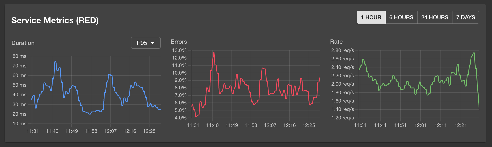
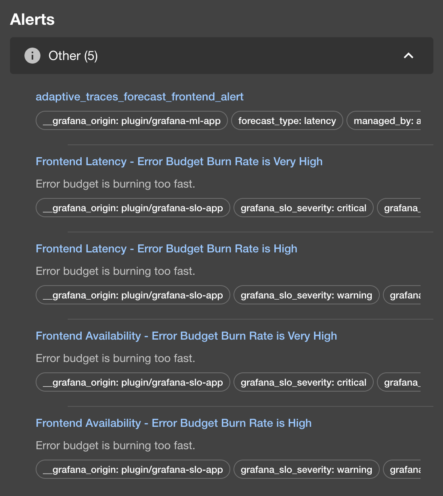
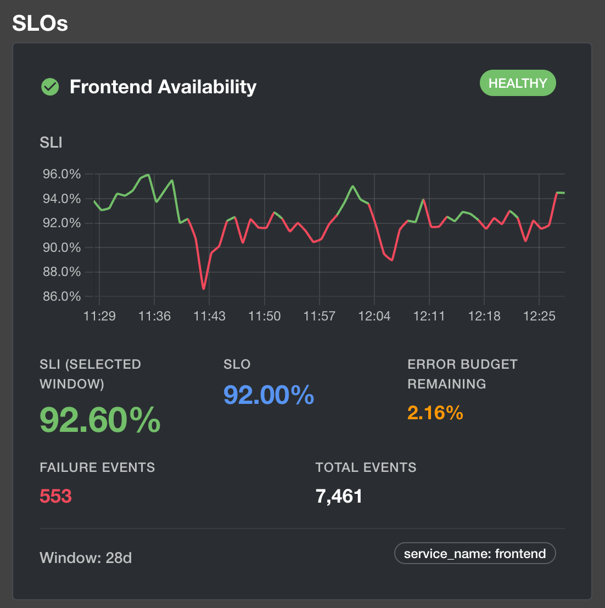

# Grafana plugin for Backstage

The Grafana plugin is a frontend plugin that provides comprehensive Grafana integration for Backstage.

> **Note:** This is an enhanced fork of the [original backstage-plugin-grafana](https://github.com/K-Phoen/backstage-plugin-grafana) by [K-Phoen](https://github.com/K-Phoen). We've built upon the excellent foundation to add advanced observability features including inline metrics visualization, enhanced alerts, and SLO tracking with time-series charts.

## Components

### Core Components (Original)
* **`EntityGrafanaDashboardsCard`** - Display dashboards for a specific entity
* **`EntityGrafanaAlertsCard`** - Display recent alerts for a specific entity
* **`EntityOverviewDashboardViewer`** - Embed an "overview" dashboard for a specific entity
* **`DashboardViewer`** - Embed any dashboard

### Enhanced Components (New in this Fork)
* **`EntityGrafanaMetricsCard`** - Display inline RED metrics (Request rate, Error rate, Duration) with time-series visualization
* **`EntityGrafanaEnhancedAlertsCard`** - Enhanced alerts display with severity grouping, metadata, and firing duration
* **`EntityGrafanaSLOCard`** - Display SLOs with error budget tracking and burn rate indicators

## Setup

Find [installation instructions](./docs/index.md#installation) in our documentation.

## Configuration

After installing the plugin, you need to configure the connection to your Grafana instance:

### 1. Configure the Grafana Proxy

Add the Grafana proxy configuration to your `app-config.yaml`:

```yaml
proxy:
  endpoints:
    '/grafana/api':
      target: 'https://YOUR_ORG.grafana.net/'  # Replace with your Grafana URL
      headers:
        Authorization: 'Bearer ${GRAFANA_TOKEN}'
```

### 2. Set Your Grafana Token

Create a service account token in Grafana with Viewer permissions:
- For Grafana Cloud: `https://YOUR_ORG.grafana.net/org/serviceaccounts`
- Store the token securely (e.g., in environment variables or `.env` file)

```bash
# In your .env file or environment
GRAFANA_TOKEN=glsa_your_token_here
```

### 3. Configure Plugin Settings

Add the Grafana plugin configuration to your `app-config.yaml`:

```yaml
grafana:
  domain: 'https://YOUR_ORG.grafana.net'
  unifiedAlerting: true  # Use unified alerting (Grafana 8+)
```

**Note:** Never commit tokens or credentials to version control. Use environment variables or secret management tools.

## Usage

### MetricsCard - Inline RED Metrics

Display RED (Request rate, Error rate, Duration) metrics inline in your entity page:

```tsx
import { EntityGrafanaMetricsCard } from '@k-phoen/backstage-plugin-grafana';

<EntityGrafanaMetricsCard />
```

**Required annotation:**
```yaml
metadata:
  annotations:
    grafana/metrics-selector: "service_name=frontend,span_kind=SPAN_KIND_SERVER"
```

**Features:**
- Time-series visualization using Chart.js
- Multiple time ranges: 1h, 6h, 24h, 7d
- Duration metrics: P95, P99, or Average (selectable)
- Auto-refresh every 60 seconds
- Adaptive sampling based on time range

### EnhancedAlertsCard - Advanced Alert Display

Display alerts with severity grouping and enhanced metadata:

```tsx
import { EntityGrafanaEnhancedAlertsCard } from '@k-phoen/backstage-plugin-grafana';

<EntityGrafanaEnhancedAlertsCard />
```

**Required annotation:**
```yaml
metadata:
  annotations:
    grafana/alert-label-selector: "service_name=frontend"
```

**Features:**
- Alerts grouped by severity (Critical, Warning, Info)
- Collapsible severity groups
- Shows firing duration
- Displays annotations (summary, description)
- Label badges for additional context

### SLOCard - Service Level Objectives

Display SLOs with error budget and burn rate tracking:

```tsx
import { EntityGrafanaSLOCard } from '@k-phoen/backstage-plugin-grafana';

<EntityGrafanaSLOCard />
```

**Required annotation:**
```yaml
metadata:
  annotations:
    grafana/slo-label-selector: "service_name=frontend"
```

**Features:**
- SLO compliance percentage
- Error budget remaining (visual progress bar)
- Status indicators (Healthy, Warning, Breached)
- Target vs current performance
- Time window display

### Example Entity Configuration

Complete example with all annotations:

```yaml
apiVersion: backstage.io/v1alpha1
kind: Component
metadata:
  name: example-service
  annotations:
    # Dashboards
    grafana/dashboard-selector: "tag=example-service"

    # Metrics (requires OpenTelemetry span metrics)
    grafana/metrics-selector: "service_name=example-service,span_kind=SPAN_KIND_SERVER"

    # Alerts (unified alerting)
    grafana/alert-label-selector: "service_name=example-service"

    # SLOs (Grafana Cloud)
    grafana/slo-label-selector: "service_name=example-service"

    # Overview dashboard
    grafana/overview-dashboard: "example-service-overview"
spec:
  type: service
  lifecycle: production
  owner: team-example
```

## How does it look?

### Original Components

Entity alerts card:


Entity dashboards card:


### Enhanced Components (New in this Fork)

Entity metrics card with RED metrics visualization:



Entity enhanced alerts card with severity grouping:



Entity SLO card with time-series tracking:



## License

This library is under the [Apache 2.0](LICENSE) license.
